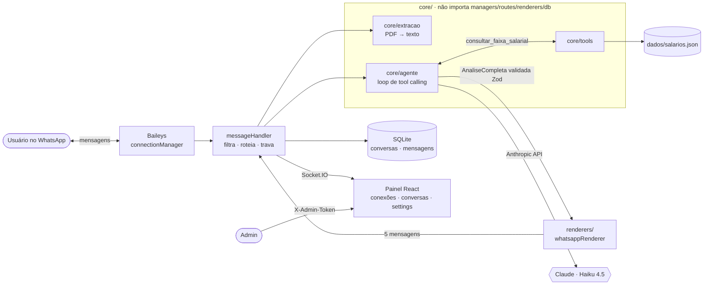

# Quanto Tô Valendo · WhatsApp Edition

**Agente de análise salarial para profissionais de dados, rodando nativo no WhatsApp.**

O usuário manda o currículo (PDF ou texto) direto no WhatsApp. O agente estima o perfil, cruza com a pesquisa **State of Data Brazil 2025-2026 (Data Hackers / Bain & Company)** e responde a pergunta central: **"quanto tô valendo — e como passo a valer mais?"**.

A resposta chega como um pequeno keynote, em **5 mensagens sequenciais** com "digitando…" entre elas:

1. **💰 O Veredito** — sua faixa hoje, senioridade estimada e justificativa citando o CV.
2. **📈 O Delta** — quanto o próximo nível paga e **quanto por mês** separa você dele (o clímax).
3. **🧭 O Caminho — o que falta** — no máximo 3 lacunas concretas.
4. **🗓️ Plano de 90 dias** — o roadmap que ataca essas lacunas.
5. **✨ One more thing** — seu resumo reescrito, pronto pro LinkedIn.

O **frontend não é para o usuário final** (que vive no WhatsApp) — é o **painel admin**: conexões via QR, histórico de conversas em tempo real, toggle do agente e edição de prompt/modelo.

---

## Arquitetura



| Camada | Stack | Porta |
|---|---|---|
| Backend | Node.js + Express + Socket.IO | 3001 |
| WhatsApp | `@whiskeysockets/baileys` (multi-conexão, sessão persistida) | — |
| Agente | `@anthropic-ai/sdk` (tool use + Zod) | — |
| Persistência | SQLite via `better-sqlite3` | — |
| Painel | React + Vite + socket.io-client + axios | 5173 |

### Regras de arquitetura (validadas por teste)
- `core/` não importa `managers/`, `routes/`, `renderers/` ou `db/`. `prompts.js` recebe o override por injeção.
- `renderers/` importam só `core/schema.js`.
- Números de salário vêm **exclusivamente** da tool. Isolamento total por `(connection_id, remote_jid)`. `ANTHROPIC_API_KEY` só no backend.

---

## Design system da narrativa

O produto usa o **meio (mensageria) a favor do keynote**:

- **Uma pergunta, uma resposta.** Se não muda o que a pessoa faz segunda de manhã, corta.
- **Números em linguagem humana.** Percentil nunca aparece: p25/p75 viram _"a maioria ganha entre X e Y"_, a mediana é _"o valor típico"_.
- **O delta é sempre mensal e em reais** (`formatarReais` → `R$ 12.500`).
- **Ritmo:** cada ato é uma mensagem separada, com intervalo de 1,5–2,5s e presença "digitando" — tensão, pausa, revelação. O "one more thing" sempre por último.
- **Formatação nativa do WhatsApp** (`*negrito*`, `_itálico_`, `> citação`, `•`) — nunca HTML nem markdown de `#`.
- **Caso staff (topo da tabela):** o Ato 2 vira reconhecimento, nunca some.

---

## Setup

Requisitos: **Node 20+**.

```bash
# 1. Backend
cd backend
cp .env.example .env      # preencha ANTHROPIC_API_KEY e ADMIN_TOKEN
npm install
npm run dev               # http://localhost:3001

# 2. Frontend (outro terminal)
cd frontend
cp .env.example .env      # aponte VITE_API_URL / VITE_SOCKET_URL para o backend
npm install
npm run dev               # http://localhost:5173
```

Variáveis do backend (`backend/.env`): `ANTHROPIC_API_KEY`, `MODELO_AGENTE` (default `claude-haiku-4-5`), `ADMIN_TOKEN`, `PORT`.

Na VPS, rode com `pm2` (`pm2 start src/server.js --name qtv-backend`). Sem deploy automatizado.

### Testes

```bash
cd backend
npm test                              # todos
npx vitest run test/renderer.test.js  # um arquivo
```

Cobrem: schema Zod, `formatarReais`, ordem/formatação/caso staff do renderer, tool (match exato, staff→Geral, sem match), filtros puros do messageHandler, a regra de dependência do `core/` e o loop de tool calling do agente com client Anthropic **mockado** (sem gastar API).

Verificação manual da análise real (precisa de chave):
```bash
cd backend && ANTHROPIC_API_KEY=sk-... npm run exemplo
```

---

## Conectando o primeiro número

1. Abra o painel, faça login com o `ADMIN_TOKEN`.
2. **Conexões → Nova Conexão**, dê um nome.
3. Clique **Conectar** — um QR aparece em tempo real.
4. No celular: WhatsApp › **Aparelhos conectados** › Conectar aparelho › escaneie.
5. O status vira **Conectado**. Mande um PDF de currículo pra esse número e receba a análise.

> **Use um número dedicado**, não o comercial principal. Baileys é biblioteca não-oficial; mesmo sendo inbound (só responde quem procura, com intervalos entre mensagens), há risco de bloqueio pelo WhatsApp.

---

## Fora do escopo

Disparos em massa, campanhas, agendamento, Telegram/Streamlit (vivem no repo Python v6), análise de vaga, gráficos, RAG, multi-tenant, deploy automatizado.
